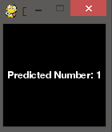

# DigitClassifier
Classifies Handwritten digits using python sklearn library

Simple paint program created using pygame which is used to give the handwritten input to the classifier

For handwritten digit recognition, run the <b>digitClassifier.py<b> file it uses the DecisionTreeClassifier imported from sklearn.tree

<b> 1. Draw the number on the window: </b>

<b> 2. Click right button for prediction and middle mousebuuton(scroll button) for clearing the screen </b>

For checking the accruacy of the trained model run the accuracy.py file

To add new training dataset, run the dataset_creator.py file and add new training data into dataset.csv file
